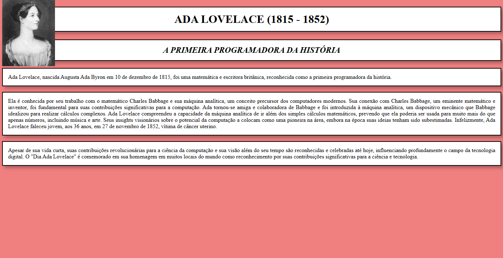

# 01-Biography
The project is a simple tribute to the renowned Ada Lovelace, a pioneering figure in the history of computing. The page structure was built using basic HTML, where I organized the elements such as images, titles, and descriptive text into distinct sections. To enhance the page's aesthetics, an appropriate background style was applied using CSS.

